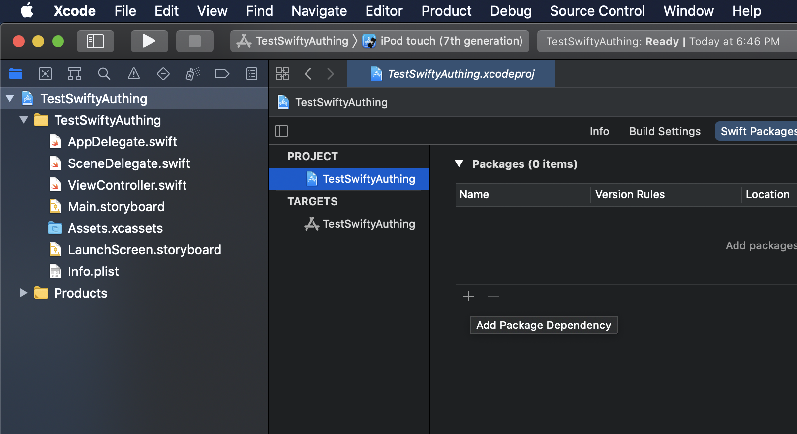
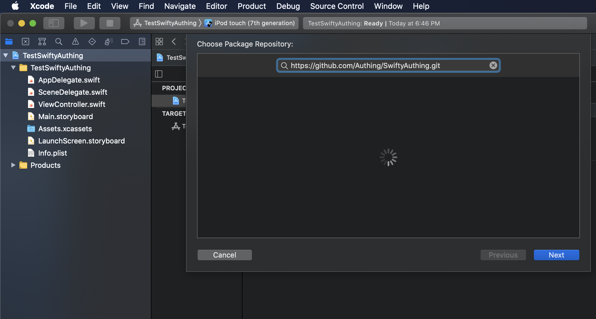
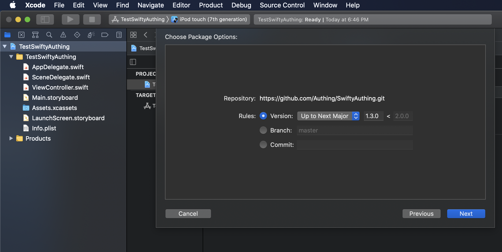

# SDK for Swift

This is a pure Swift library for [Authing](https://authing.cn).


</img>

## Requirements

- Swift 5.0 +
- Xcode 11 +
- iOS 10+


## Installation

### Swift Package Manager

1. Xcode - Project - Swift Packages
2. Add + https://github.com/Authing/SwiftyAuthing.git
3. Select the latest version







4. Update to latest version (optional)


## Example

1. Clone repository

2. Change **UserPoolId and Host** in SwiftyAuthingExample - ViewController.swift

3. Run **SwiftyAuthingExample** with iOS simulator or device.

4. Test and check data with web console [https://console.authing.cn](https://console.authing.cn)


## How to use

```swift
import SwiftyAuthing

/// Config Information, change your UserPoolId, Secret, and Host
/// Find in https://console.authing.cn Setting - Basic Information.
let userPoolId = "userPoolId"
let host = "https://core.authing.cn/graphql/v2"

var client: AuthenticationClient?
var userid = ""

self.client = AuthenticationClient(userPoolId: userPoolId, host: host)


/// Register by Email and Password.
/// 使用邮箱注册
///
func registerByEmail() {
    self.client?.registerByEmail(email: textEmail.text!, password: textPassword.text!, completion: {status in
        if(status.errors == nil) {
            //Success
            print(status.data?.registerByEmail ?? "")
            self.userid = status.data?.registerByEmail?.id ?? ""
        } else {
            //Failure
            print(status.errors ?? "")
        }
    })
}

/// Register by Username and Password.
/// 使用用户名注册
///
func registerByUsername() {
    self.client?.registerByUsername(username: textUsername.text!, password: textPassword.text!, completion:{status in
        if(status.errors == nil) {
            //Success
            print(status.data?.registerByUsername ?? "")
            self.userid = status.data?.registerByUsername?.id ?? ""
        } else {
            //Failure
            print(status.errors ?? "")
        }
    })
}

/// Register by Phone Number and SMS Code.
/// 使用手机号注册
///
func registerByPhoneCode() {
    self.client?.registerByPhoneCode(phone: textPhone.text!, code: textPhonecode.text!, completion:{ status in
        if(status.errors == nil) {
            //Success
            print(status.data?.registerByPhoneCode ?? "")
            self.userid = status.data?.registerByPhoneCode?.id ?? ""
        } else {
            //Failure
            print(status.errors ?? "")
        }
    })
}

/// Check Password Strength.
/// 检查密码强度
///
func checkPasswordStrength() {
    self.client?.checkPasswordStrength(password: textPassword.text!, completion:{ status in
        if(status.errors == nil) {
            //Success
            print(status.data?.checkPasswordStrength ?? "")
        } else {
            //Failure
            print(status.errors ?? "")
        }
    })
}

/// Send SMS Code to Phone Number.
/// 发送短信验证码
///
func sendSmsCode() {
    self.client?.sendSmsCode(phone: textPhone.text!, completion: { status in
        print(status)
    })
}


/// Login by Email and Password.
/// 使用邮箱登录
///
func loginByEmail() {
    self.client?.loginByEmail(email: textEmail.text!, password: textPassword.text!, completion:{ status in
        if(status.errors == nil) {
            //Success
            print(status.data?.loginByEmail ?? "")
        } else {
            //Failure
            print(status.errors ?? "")
        }
    })
}


/// Login with Username and Password.
/// 使用用户名登录
func loginByUsername() {
    self.client?.loginByUsername(username: textUsername.text!, password: textPassword.text!, completion:{ status in
        if(status.errors == nil) {
            //Success
            print(status.data?.loginByUsername ?? "")
        } else {
            //Failure
            print(status.errors ?? "")
        }
    })
}

/// Login by Phone Number and SMS Code.
/// 使用手机号验证码登录
///
func loginByPhoneCode() {
    self.client?.loginByPhoneCode(phone: textPhone.text!, code: textPhonecode.text!, completion:{ status in
        if(status.errors == nil) {
            //Success
            print(status.data?.loginByPhoneCode ?? "")
        } else {
            //Failure
            print(status.errors ?? "")
        }
    })
}


/// Login by Phone Number and Password.
/// 使用手机号密码登录
///
func loginByPhonePassword() {
    self.client?.loginByPhonePassword(phone: textPhone.text!, password: textPassword.text!, completion:{ status in
        if(status.errors == nil) {
            //Success
            print(status.data?.loginByPhonePassword ?? "")
        } else {
            //Failure
            print(status.errors ?? "")
        }
    })
}


/// Check Login Status.
/// 检测 Token 登录状态
///
func checkLoginStatus() {
    // Change your accessToken here
    let accessToken = self.client?.accessToken ?? ""
    print("accessToken: " + accessToken)
    self.client?.checkLoginStatus(token: accessToken, completion:{ status in
        if(status.errors == nil) {
            //Success
            print(status.data?.checkLoginStatus ?? "")
        } else {
            //Failure
            print(status.errors ?? "")
        }
    })
}


/// Send Email.
/// 发送邮件
///
func sendEmail() {
    self.client?.sendEmail(email: textEmail.text!, scene: EmailScene.resetPassword, completion: {status in
        if(status.errors == nil) {
            //Success
            print(status.data?.sendEmail ?? "")
        } else {
            //Failure
            print(status.errors ?? "")
        }
    })
}

/// Reset Password by Phone Code.
/// 通过短信验证码重置密码
///
func resetPasswordByPhoneCode() {
    self.client?.resetPasswordByPhoneCode(phone: textPhone.text!, code: textPhonecode.text!, newPassword: textPassword.text!, completion: {status in
        if(status.errors == nil) {
            //Success
            print(status.data?.resetPassword ?? "")
        } else {
            //Failure
            print(status.errors ?? "")
        }
    })
}

/// Reset Password by Email Code.
/// 通过邮件验证码重置密码
///
func resetPasswordByEmailCode() {
    self.client?.resetPasswordByEmailCode(email: textEmail.text!, code: textPhonecode.text!, newPassword: textPassword.text!, completion: {status in
        if(status.errors == nil) {
            //Success
            print(status.data?.resetPassword ?? "")
        } else {
            //Failure
            print(status.errors ?? "")
        }
    })
}


/// Update Profile.
/// 修改用户资料
///
func updateProfile() {
    self.client?.updateProfile(nickname: textUsername.text!, completion: {status in
        if(status.errors == nil) {
            //Success
            print(status.data?.updateUser ?? "")
        } else {
            //Failure
            print(status.errors ?? "")
        }
    })
}


/// Update Password.
/// 更新用户密码
///
func updatePassword() {
    self.client?.updatePassword(newPassword: textPassword.text!,oldPassword: textPassword.text!, completion: {status in
        if(status.errors == nil) {
            //Success
            print(status.data?.updatePassword ?? "")
        } else {
            //Failure
            print(status.errors ?? "")
        }
    })
}


/// Update Phone.
/// 更新用户手机号
///
func updatePhone() {
    self.client?.updatePhone(phone: textPhone.text!, phoneCode: textPhonecode.text!, oldPhone: textPhone.text!, oldPhoneCode: textPhonecode.text!, completion: {status in
        if(status.errors == nil) {
            //Success
            print(status.data?.updatePhone ?? "")
        } else {
            //Failure
            print(status.errors ?? "")
        }
    })
}


/// Update Email.
/// 更新用户邮箱
///
func updateEmail() {
    self.client?.updateEmail(email: textEmail.text!, emailCode: textPhonecode.text!, oldEmail: textEmail.text!, oldEmailCode: textPhonecode.text!, completion: {status in
        if(status.errors == nil) {
            //Success
            print(status.data?.updateEmail ?? "")
        } else {
            //Failure
            print(status.errors ?? "")
        }
    })
}


///Refresh Token.
/// 刷新当前用户的 token
///
func refreshToken() {
    self.client?.refreshToken(completion:{ status in
        if(status.errors == nil) {
            //Success
            print(status.data?.refreshToken ?? "")
        } else {
            //Failure
            print(status.errors ?? "")
        }
    })
}


/// Get Current User.
/// 获取当前登录的用户信息
///
func getCurrentUser() {
    self.client?.getCurrentUser(completion: {status in
        if(status.errors == nil) {
            //Success
            print(status.data?.user ?? "")
        } else {
            //Failure
            print(status.errors ?? "")
        }
    })
}


/// Logout Current User.
/// 退出登录
///
func logout() {
    self.client?.logout(completion:{ status in
        if(status.errors == nil) {
            //Success
            print(status.data?.updateUser ?? "")
        } else {
            //Failure
            print(status.errors ?? "")
        }
    })
}

/// bindPhone.
/// 绑定手机号
///
func bindPhone() {
    self.client?.bindPhone(phone: textPhone.text!, phoneCode: textPhonecode.text!, completion:{ status in
        if(status.errors == nil) {
            //Success
            print(status.data?.bindPhone ?? "")
        } else {
            //Failure
            print(status.errors ?? "")
        }
    })
}


/// unbindEmail.
/// 解绑邮箱
///
func unbindEmail() {
    self.client?.unbindEmail(completion:{ status in
        if(status.errors == nil) {
            //Success
            print(status.data?.unbindEmail ?? "")
        } else {
            //Failure
            print(status.errors ?? "")
        }
    })
}


/// bindPhone.
/// 绑定手机号
///
func unbindPhone() {
    self.client?.unbindPhone(completion:{ status in
        if(status.errors == nil) {
            //Success
            print(status.data?.unbindPhone ?? "")
        } else {
            //Failure
            print(status.errors ?? "")
        }
    })
}

/// List Udv.
/// 获取当前用户的自定义数据列表
///
func listUdv() {
    self.client?.listUdv(completion:{ status in
        if(status.errors == nil) {
            //Success
            print(status.data?.udv ?? "")
        } else {
            //Failure
            print(status.errors ?? "")
        }
    })
}


/// Set Udv.
/// 添加自定义数据
///
func setUdv() {
    self.client?.setUdv(key: "HelloDate", value: Date(), completion:{ status in
        if(status.errors == nil) {
            //Success
            print(status.data?.setUdv ?? "")
        } else {
            //Failure
            print(status.errors ?? "")
        }
    })
}

/// Remove Udv.
/// 删除自定义数据
///
func removeUdv() {
    self.client?.removeUdv(key: "HelloDate", completion:{ status in
        if(status.errors == nil) {
            //Success
            print(status.data?.removeUdv ?? "")
        } else {
            //Failure
            print(status.errors ?? "")
        }
    })
}


/// listOrg.
/// 获取用户所在组织机构
func listOrg() {
    self.client?.listOrg(completion: { status in
        print(status)
    })
}

/// loginByLdap.
/// 使用 LDAP 用户名登录
func loginByLdap() {
    self.client?.loginByLdap(username: textUsername.text!, password: textPassword.text!, completion: { status in
        print(status)
    })
}


/// Login by WeChat Code.
/// 通过微信认证码登陆
///
func loginByWeChatCode() {
    //通过微信SDK返回的认证码登陆 https://docs.authing.cn/social-login/mobile/wechat.html
    let code = "041jya0w35SheV2Czq0w3kR57j2jya0T"
    self.client?.loginByWeChatCode(code: code, completion: { status in
        print(status)
    })
}

```

