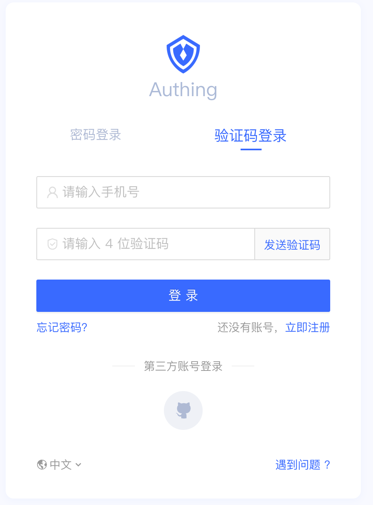
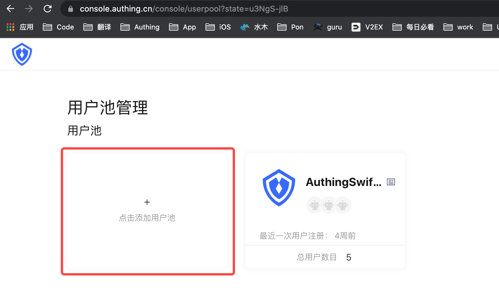
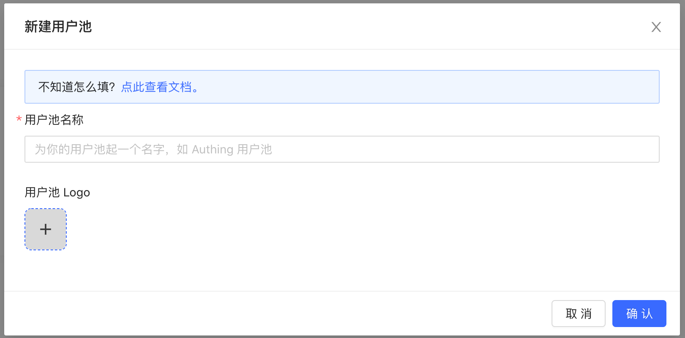
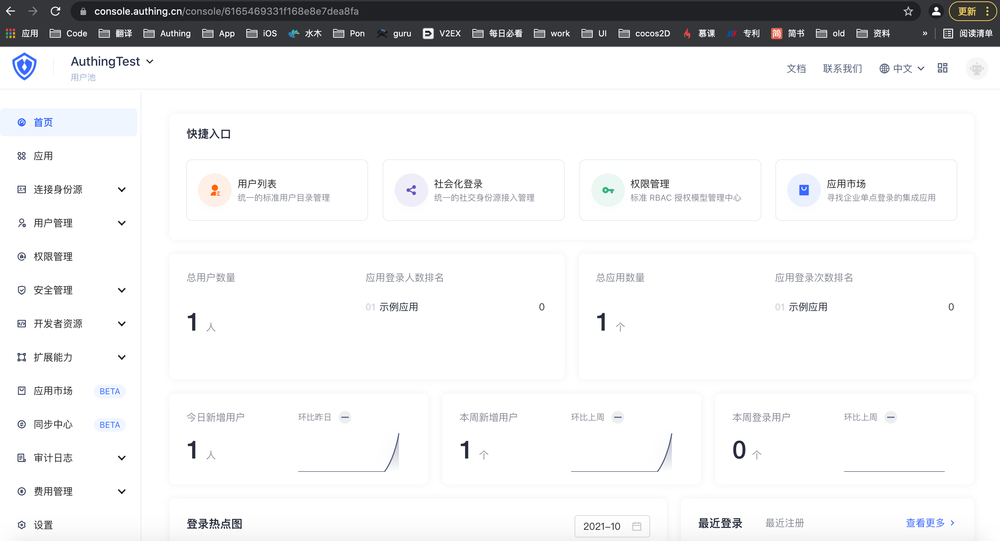
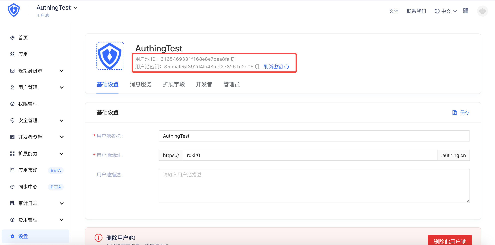
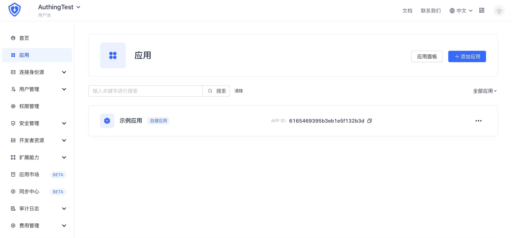
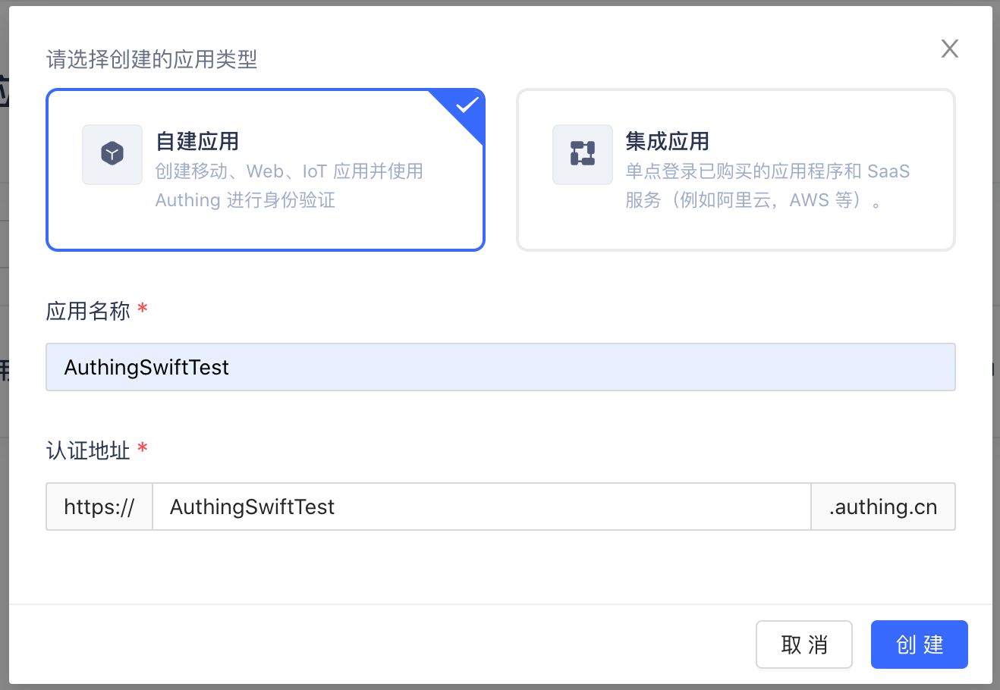
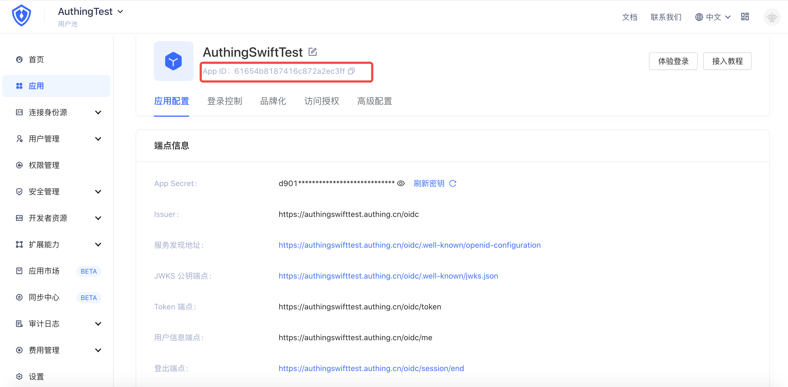
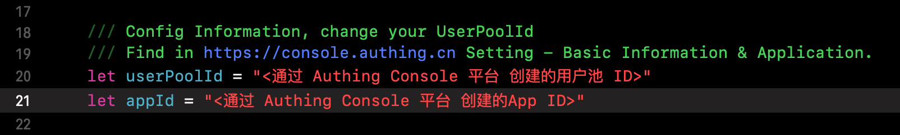

# Authing Swift SDK Guide
​	Authing Swift SDK 为企业和开发者提供专业的身份认证和授权服务。

​	Authing Swift SDK 以终端用户（End User）的身份进行请求，提供了登录、注册、登出、管理用户资料、获取授权资源等所有管理用户的方法。但是不提供管理员（Administrator）身份的相关接口调用方法。

## GitHub 下载地址

| 条目     | 说明                                         |
| -------- | -------------------------------------------- |
| 支持版本 | - Swift 5.0 +<br/>- Xcode 11 +<br/>- iOS 10+ |
| 仓库地址 | https://github.com/Authing/SwiftyAuthing.git |

# 安装

​	Authing Swift SDK 支持多种方式下载安装。

## CocoaPods 安装

​	采用 CocoaPods 将 Authing Swift SDK 集成到 Xcode 项目中，在 **Podfile** 中加入如下代码：

```
	pod 'SwiftAuthing', '~> 4.0'
```

​	下载完成后，使用命令行工具进入到工程根目录下，输入：pod install 更新后，即可成功打开工程。

## Swift Package Manager 安装

​	采用 Swift Package Manager 将 Authing Swift SDK 集成到 Xcode 项目中，在 **Package.swift** 文件中加入如下 **dependencies** 代码：

```
	dependencies: [
    .package(url: "https://github.com/Authing/SwiftyAuthing.git", .upToNextMajor(from: "4.0.0"))
	]
```

​	下载完成后，进入工程根目录，打开 SwiftyAuthingExample.xcodeproj 工程，等待 Swift Package 下载完成即可。。

## Demo 直接安装

​	你可以直接使用 Git 克隆 https://github.com/Authing/SwiftyAuthing.git ，下载项目 Demo 工程。

​	下载完成后，使用命令行工具进入到工程根目录下，输入：pod install 更新后，即可成功打开工程。

# 如何使用

## 注册 Authing 

​	进入 https://console.authing.cn/ ，注册开发者账号。



​	注册完成后，登录后，进入主页面



​	点击【点击添加用户池】按钮，弹出“新建用户池”窗口



​	输入【用户池名称】（必填）和【用户池Logo】（非必填），创建成功后，进入用户池管理首页：



​	点击左上【 AuthingTest 】下拉菜单按钮，选择【设置】，进入用户池详情页：



​	这里有用户池的详细信息，包含：**用户池 ID**，**用户池密钥** 等信息，以及用户池的管理功能。

## 注册应用

​	在用户池管理首页，点击左侧菜单栏【应用】按钮，进入应用管理页：



​	点击【添加应用】按钮，进入应用创建窗口：



​		选择【自建应用】，并输入【应用名称】和【认证地址】，点击【创建】按钮，创建移动应用，创建成功后，进入应用详情页：



​	应用详情页有应用的 详细信息，包含了：**App ID** 等信息。

## 项目工程初始化

1. 进入已经成功pod 更新后的工程根目录下后，点击 SwiftyAuthingExample.xcworkspace 使用 Xcode 打开工程，打开 ViewController.swift 文件，在20，21 行找到 **UserPoolId, appId** ，将之前创建的用户池 ID 和 App ID（应用 ID ）分别更新。




2. 用模拟器或者真机启动 **SwiftyAuthing** 项目。
3. 使用 web 网站 [https://console.authing.cn](https://console.authing.cn) 测试和检查数据是否正确。

## 私有化部署设置

​	私有化部署需要修改 config 目录下 Config.Swift 文件中的 domainDefault 和 domain 两个参数值。
```swift
	/// Default Domain.
    ///
    public static let domainDefault = "https://xxx.com"
    
    /// Domain.
    ///
    public static var domain = "https://xxx.com"
```

# 接口说明
## 使用邮箱注册

> 接口名称：registerByEmail
>
> 接口说明：使用邮箱注册，邮箱不区分大小写且用户池内唯一。此接口不要求用户对邮箱进行验证，用户注册之后 emailVerified 字段会为 false 。如果你希望邮箱未验证的用户不能进行登录，可以在用户池的**设置** - **安全信息** 中开启**禁止未验证邮箱的用户登录**选项：

- **参数**
   - `email` \<String\> 邮箱
   - `password` \<String\> 密码

- **示例**

```swift
    self.client?.registerByEmail(email: textEmail.text!, password: textPassword.text!, completion: {status in
            if(status.errors == nil) {
                //Success
                print(status.data?.registerByEmail ?? "")
                self.userid = status.data?.registerByEmail?.id ?? ""
            } else {
                //Failure
                print(status.errors ?? "")
            }
        })
```

## 使用用户名注册

> 接口名称：registerByUsername
>
> 接口说明：使用用户名注册，用户名区分大小写且用户池内唯一。

- **参数**
  - `username` \<String\> 用户名
  - `password` \<String\> 密码
  
- **示例**

```swift
    self.client?.registerByUsername(username: textUsername.text!, password: textPassword.text!, completion:{status in
            if(status.errors == nil) {
                //Success
                print(status.data?.registerByUsername ?? "")
                self.userid = status.data?.registerByUsername?.id ?? ""
            } else {
                //Failure
                print(status.errors ?? "")
            }
        })
```

## 使用手机号注册

> 接口名称：registerByPhoneCode
>
> 接口说明：使用手机号注册，你可以同时设置该账号的初始密码。发送短信的接口请见 [sendSmsCode](#发送短信验证码)

- **参数**
  - `code` \<String\> 短信验证码
  - `phone` \<String\> 手机号

- **示例**

```swift
    self.client?.registerByPhoneCode(phone: textPhone.text!, code: textPhonecode.text!, completion:{ status in
            if(status.errors == nil) {
                //Success
                print(status.data?.registerByPhoneCode ?? "")
                self.userid = status.data?.registerByPhoneCode?.id ?? ""
            } else {
                //Failure
                print(status.errors ?? "")
            }
        })
```

## 使用邮箱登录

> 接口名称：registerByPhoneCode
>
> 接口说明：使用邮箱登录，该接口默认不会限制未验证的邮箱进行登录，如果你希望邮箱未验证的用户不能进行登录，可以使用 pipeline 对此类请求进行拦截。


> 如果你的用户池配置了登录失败检测，当同一 IP 下登录多次失败的时候会要求用户输入图形验证码（code 为 2000)。

- **参数**
  - `email` \<String\> 邮箱
  - `password` \<String\> 密码


- **示例**

```swift
    self.client?.loginByEmail(email: textEmail.text!, password: textPassword.text!, completion:{ status in
            if(status.errors == nil) {
                //Success
                print(status.data?.loginByEmail ?? "")
            } else {
                //Failure
                print(status.errors ?? "")
            }
        })
```

## 使用用户名登录

> 接口名称：loginByUsername
>
> 接口说明：使用用户名登录。如果你的用户池开启了[登录失败检测](/guides/security/config-login-fail-limit.md)，当同一 IP 下登录多次失败的时候会要求用户输入图形验证码（错误码 为 2000)。

- **参数**
  - `username` \<String\> 用户名
  - `password` \<String\> 密码

- **示例**

```swift
    self.client?.loginByUsername(username: textUsername.text!, password: textPassword.text!, completion:{ status in
            if(status.errors == nil) {
                //Success
                print(status.data?.loginByUsername ?? "")
            } else {
                //Failure
                print(status.errors ?? "")
            }
        })
```

## 使用手机号验证码登录

> 接口名称：loginByPhoneCode
>
> 接口说明：使用手机号验证码登录。你需要先使用 [sendSmsCode](#发送短信验证码) 方法发送短信验证码。

- **参数**
	- `phone` \<String\> 手机号；
	- `code` \<String\> 短信验证码，你可以通过 [sendSmsCode](#发送短信验证码) 方法发送短信验证码；
	
- **示例**

```swift
	self.client?.loginByPhoneCode(phone: textPhone.text!, code: textPhonecode.text!, completion:{ status in
            if(status.errors == nil) {
                //Success
                print(status.data?.loginByPhoneCode ?? "")
            } else {
                //Failure
                print(status.errors ?? "")
            }
        })
```

## 使用手机号密码登录

> 接口名称：loginByPhonePassword
>
> 接口说明：如果用户绑定了手机号且设置了密码，可以使用手机号 + 密码的方式登录。如果你的用户池开启了[登录失败检测](/guides/security/config-login-fail-limit.md)，当同一 IP 下登录多次失败的时候会要求用户输入图形验证码（错误码 为 2000)。

- **参数**
	- `phone` \<String\> 手机号
	- `password` \<String\> 密码
	
- **示例**

```swift
	self.client?.loginByPhonePassword(phone: textPhone.text!, password: textPassword.text!, completion:{ status in
            if(status.errors == nil) {
                //Success
                print(status.data?.loginByPhonePassword ?? "")
            } else {
                //Failure
                print(status.errors ?? "")
            }
        })
```

## 子账号登录

> 接口名称：loginBySubAccount
>
> 接口说明：如果用户开启了子账号登录，可以使用子账号登录。如果你的用户池开启了[登录失败检测](/guides/security/config-login-fail-limit.md)，当同一 IP 下登录多次失败的时候会要求用户输入图形验证码（错误码 为 2000)。

- **参数**
	- `account` \<String\> 子账号
	- `password` \<String\> 密码
	
- **示例**

```swift
    self.client?.loginBySubAccount(username: textUsername.text!, password: textPassword.text!, completion: { (status) in
            if(status.errors == nil) {
                //Success
                print(status.data?.loginBySubAccount ?? "")
            } else {
                //Failure
                print(status.errors ?? "")
            }
        })
```


## 使用 LDAP 用户名登录

> 接口名称：loginByLdap
>
> 接口说明：使用 LDAP 身份源的账号密码登录。如果此账号第一次登录，将会将其用户信息导入到用户池的用户目录中；之后再次登录，将会根据获取到的最新的账号资料更新此账号的用户信息。 点此查看[连接 LDAP 身份源](/connections/ldap/)文档。

- **参数**
	- `username` \<String\> 用户名
	- `password` \<string\> 密码
	
- **示例**

```swift
    self.client?.loginByLdap(username: textUsername.text!, password: textPassword.text!, completion: { (status) in
            print(status)
        })
```

## 使用 AD 用户名登录

> 接口名称：loginByAD
>
> 接口说明：使用 AD 域的账号登录。如果此账号第一次登录，将会将其用户信息导入到用户池的用户目录中；之后再次登录，将会根据获取到的最新的账号资料更新此账号的用户信息。
> 点此查看[连接 Active Directory 身份源](/connections/ad/)文档。

- **参数**
	- `username` \<String\> 用户名
	- `password` \<String\> 密码
	
- **示例**

```swift
    self.client?.loginByAD(username: textUsername.text!, password: textPassword.text!) { (status) in
            let statusDic = status as! NSDictionary
            print(statusDic)
        }
```

## 获取当前登录的用户信息

> 接口名称：getCurrentUser
>
> 接口说明：获取当前登录用户的用户信息，需要 AuthenticationClient 当前处于已登录状态才能获取到。你可以通过两种方式设置 AuthenticationClient 的登录状态：
>
> ​				  调用登录接口（如密码登录、手机号验证码登录、社会化登录）之后，AuthenticationClient 会缓存用户的 [id_token](/concepts/id-token.md)，从而记住登录状态；

- **示例**

```swift
    self.client?.getCurrentUser(completion: {status in
            if(status.errors == nil) {
                //Success
                print(status.data?.user ?? "")
            } else {
                //Failure
                print(status.errors ?? "")
            }
        })
```

## 退出登录

> 接口名称：logout
>
> 接口说明：用于用户退出登录，将会清空本地数据

- **示例**

```swift
		self.client?.logout(completion: { (status) in
            print(status)
        })
```

## 获取当前用户的自定义数据列表

> 接口名称：listUdv
>
> 接口说明：获取当前用户的自定义数据列表


- **示例**

```swift
    self.client?.listUdv(completion:{ status in
            if(status.errors == nil) {
                //Success
                print(status.data?.udv ?? "")
            } else {
                //Failure
                print(status.errors ?? "")
            }
        })
```


## 添加用户自定义数据

> 接口名称：setUdv
>
> 接口说明：添加用户自定义数据

- **参数**

	- `key` \<String\> 自定义属性名
	- `value` \<String\> 属性值

- **示例**

```swift
    self.client?.setUdv(key: "fatherAge", value: "50", completion: { (status) in
            if(status.errors == nil) {
                //Success
                print(status.data?.setUdv ?? "")
            } else {
                //Failure
                print(status.errors ?? "")
            }
        })
```


## 获取用户所在组织机构数据列表

> 接口名称：listOrg
>
> 接口说明：获取用户所在组织机构数据列表


- **示例**

```swift
    self.client?.listOrg(completion: { status in
            print(status)
        })
```


## 发送短信验证码

> 接口名称：sendSmsCode
>
> 接口说明：发送短信验证码, 目前仅支持国内手机号；该接口有接口频率限制，请勿频繁请求。建议在UI 层进行频繁操作限制

- **参数**

	- `phone` \<String\> 手机号

- **示例**

```swift
    self.client?.sendSmsCode(phone: textPhone.text!, completion: { status in
            print(status)
        })
```

## 发送邮件

> 接口名称：sendEmail
>
> 接口说明：主动发送邮件给用户，目前支持的 4 类邮件包含：重置密码邮件、验证邮箱邮件、修改邮箱验证码邮件、MFA 验证邮件。同时你可以[自定义邮件模版和配置第三方邮件服务商](/guides/userpool-config/email/)。

- **参数**

  - `email` \<String\> 邮箱
  - `scene` \<EmailScene\> 发送场景，可选值为 RESET_PASSWORD（发送重置密码邮件，邮件中包含验证码）、VERIFY_EMAIL（发送验证邮箱的邮件）、CHANGE_EMAIL（发送修改邮箱邮件，邮件中包含验证码）
     	 - `RESET_PASSWORD`: 发送重置密码邮件，邮件中包含验证码；
          	 - `VERIFY_EMAIL`: 发送验证邮箱的邮件；
                	 - `CHANGE_EMAIL`: 发送修改邮箱邮件，邮件中包含验证码；
       - `MFA_VERIFY`: 发送 MFA 验证邮件。

- **示例**

```swift
    self.client?.sendEmail(email: textEmail.text!, scene: EmailScene.resetPassword, completion: {status in
            if(status.errors == nil) {
                //Success
                print(status.data?.sendEmail ?? "")
            } else {
                //Failure
                print(status.errors ?? "")
            }
        })
```

## 获取自定义数据

> 接口名称：listUdv
>
> 接口说明：获取用户的所有自定义数据。你需要先在用户池[定义用户自定义数据元信息](/guides/users/user-defined-field/)。

- **示例**

```swift
    self.client?.listUdv(completion:{ status in
            if(status.errors == nil) {
                //Success
                print(status.data?.udv ?? "")
            } else {
                //Failure
                print(status.errors ?? "")
            }
        })
```


## 删除自定义数据

> 接口名称：removeUdv
>
> 接口说明：删除自定义数据。

- **参数**

  - `key` \<String\> 自定义字段的 key 

- **示例**

```swift
    self.client?.removeUdv(key: "HelloDate", completion:{ status in
            if(status.errors == nil) {
                //Success
                print(status.data?.removeUdv ?? "")
            } else {
                //Failure
                print(status.errors ?? "")
            }
        })
```

## 检测 Token 登录状态

> 接口名称：checkLoginStatus
>
> 接口说明：检测 Token 登录状态。


- **示例**

```swift
    self.client?.checkLoginStatus(token: token, completion:{ status in
            if(status.errors == nil) {
                //Success
                print(status.data?.checkLoginStatus ?? "")
            } else {
                //Failure
                print(status.errors ?? "")
            }
        })
```

## 通过短信验证码重置密码

> 接口名称：resetPasswordByPhoneCode
>
> 接口说明：通过短信验证码重置密码，你可以通过 [sendSmsCode](#发送短信验证码) 方法发送短信验证码。

- **参数**

  - `phone` \<String\> 手机号
  - `code` \<String\> 验证码
  - `newPassword` \<String\> 新的密码

- **示例**

```swift
    self.client?.resetPasswordByPhoneCode(phone: textPhone.text!, code: textPhonecode.text!, newPassword: textPassword.text!, completion: { (status) in
            if(status.errors == nil) {
                //Success
                print(status.data?.resetPassword ?? "")
            } else {
                //Failure
                print(status.errors ?? "")
            }
        })
```

## 通过邮件验证码重置密码

> 接口名称：resetPasswordByEmailCode
>
> 接口说明：通过邮件验证码重置密码，你需要先调用 [sendEmail](#发送邮件) 接口发送重置密码邮件（场景值为 `RESET_PASSWORD`）。

- **参数**

  - `email` \<String\> 邮箱
  - `code` \<String\> 验证码
  - `newPassword` \<String\> 新的密码

- **示例**

```swift
    self.client?.resetPasswordByEmailCode(email: textEmail.text!, code: textPhonecode.text!, newPassword: textPassword.text!, completion:{ (status) in
            if(status.errors == nil) {
                //Success
                print(status.data?.resetPassword ?? "")
            } else {
                //Failure
                print(status.errors ?? "")
            }
        })
```

## 修改用户资料

> 接口名称：updateProfile
>
> 接口说明：修改用户资料，此接口不能用于修改手机号、邮箱、密码，如果需要请调用 [updatePhone](#更新用户手机号)、[updateEmail](#更新用户邮箱)、[updatePassword](#更新用户密码) 接口。

- **参数**

	- `username` \<String\> 用户名
	- `nickname` \<String\> 昵称
	- `photo` \<String\> 头像
	- `company` \<String\> 公司
	- `browser` \<String\> 浏览器
	- `device` \<String\> 设备
	- `lastIP` \<String\> 最近登录的 IP
	- `name` \<String\> Name
	- `givenName` \<String\> Given Name
	- `familyName` \<String\> Family Name
	- `formatted` \<String\> 详细地址
	- `middleName` \<String\> Middle Name
	- `profile` \<String\> Profile Url
	- `preferredUsername` \<String\> Preferred Name
	- `website` \<String\> 个人网站
	- `gender` \<String\> 性别, M（Man） 表示男性、F（Female） 表示女性、未知表示 U（Unknown）
	- `birthdate` \<String\> 生日
	- `zoneinfo` \<String\> 时区
	- `locale` \<String\> 语言
	- `address` \<String\> 地址
	- `streetAddress` \<String\> 街道地址
	- `locality` \<String\>
	- `region` \<String\> 地域
	- `postalCode` \<String\> 邮编
	- `city` \<String\> 城市
	- `province` \<String\> 省份
	- `country` \<String\> 国家

- **示例**

```swift
    self.client?.updateProfile(email: "122@163.com", completion: { (status) in
            print(status)
        })
```

## 更新用户密码

> 接口名称：updatePassword
>
> 接口说明：更新用户密码

- **参数**

- `newPassword` \<String\> 新密码

- **示例**

```swift
    self.client?.updatePassword(newPassword: textPassword.text!, completion:{ (status) in
            if(status.errors == nil) {
                //Success
                print(status.data?.updatePassword ?? "")
            } else {
                //Failure
                print(status.errors ?? "")
            }
        })
```

## 绑定手机号

> 接口名称：bindPhone
>
> 接口说明：用户初次绑定手机号，如果需要修改手机号请使用 [updatePhone](#更新用户手机号) 方法。如果该手机号已被绑定，将会绑定失败。发送验证码请使用 [sendSmsCode](#发送短信验证码) 方法。

> 终端用户也可以[在个人中心自助绑定手机号](/guides/user/manage-profile.md#绑定手机号)：


- **参数**

- `phone` \<String\> 手机号
- `phoneCode` \<String\> 短信验证码，你可以通过 [sendSmsCode](#发送短信验证码) 方法发送短信验证码

- **示例**

```swift
    self.client?.bindPhone(phone: textPhone.text!, phoneCode: textPhonecode.text!, completion: { (status) in
            if(status.errors == nil) {
                //Success
                print(status.data?.bindPhone ?? "")
            } else {
                //Failure
                print(status.errors ?? "")
            }
        })
```

## 解绑手机号

> 接口名称：unbindPhone
>
> 接口说明：用户解绑手机号，如果用户没有绑定其他登录方式（邮箱、社会化登录账号），将无法解绑手机号，会提示错误。
>
> ​		终端用户也可以[在个人中心自助解绑手机号](/guides/user/manage-profile.md#绑定手机号)：


- **示例**

```swift
    self.client?.unbindPhone(completion: { (status) in
            if(status.errors == nil) {
                //Success
                print(status.data?.unbindPhone ?? "")
            } else {
                //Failure
                print(status.errors ?? "")
            }
        })
```

## 更新用户手机号

> 接口名称：updatePhone
>
> 接口说明：更新用户手机号。和修改邮箱一样，默认情况下，如果用户当前已经绑定了手机号，需要同时验证原有手机号（目前账号绑定的手机号）和当前邮箱（将要绑定的手机号）。 也就是说，用户 A 当前绑定的手机号为 15888888888，想修改为 15899999999，那么就需要同时验证这两个手机号。 开发者也可以选择不开启 “验证原有手机号“ ，可以在 {{$localeConfig.brandName}} 控制台的**设置**目录下的**安全信息**模块进行关闭。
>
> ​		用户首次绑定手机号请使用 [bindPhone](#绑定手机号) 接口。


- **参数**

- `phone` \<String\> 新手机号
- `phoneCode` \<String\> 新手机号的验证码
- `oldPhone` \<String\> 旧手机号
- `oldPhoneCode` \<String\> 旧手机号的验证码

- **示例**

```swift
    self.client?.updatePhone(phone: textPhone.text!, phoneCode: textPhonecode.text!, oldPhone: textPhone.text!, oldPhoneCode: textPhonecode.text!, completion: {status in
            if(status.errors == nil) {
                //Success
                print(status.data?.updatePhone ?? "")
            } else {
                //Failure
                print(status.errors ?? "")
            }
        })
```

## 绑定邮箱

> 接口名称：bindEmail
>
> 接口说明：用于用户初次绑定邮箱，需检验邮箱验证码。如果需要修改邮箱请使用 [updateEmail](#更新用户邮箱) 方法。如果该邮箱已被绑定，将会绑定失败。发送邮件验证码请使用 [sendEmail](#发送邮件) 方法。
> 终端用户也可以[在个人中心自助绑定邮箱](/guides/user/manage-profile.md#绑定邮箱)：


- **参数**

- `email` \<String\> 邮箱
- `emailCode` \<String\> 邮件验证码，可通过 [sendEmail](#发送邮件) 方法获得，EmailScene 为 CHANGE_EMAIL

- **示例**

```swift
    self.client?.bindEmail(email: textEmail.text!, emailCode: textPhonecode.text!, completion: { (status) in
            if(status.errors == nil) {
                //Success
                print(status.data?.bindEmail ?? "")
            } else {
                //Failure
                print(status.errors ?? "")
            }
        })
```

## 解绑邮箱

> 接口名称：unbindEmail
>
> 接口说明：用户解绑手机号，如果用户没有绑定其他登录方式（手机号、社会化登录账号），将无法解绑邮箱，会提示错误。
>
> ​		终端用户也可以[在个人中心自助解绑邮箱](/guides/user/manage-profile.md#绑定邮箱)：


- **示例**

```swift
		self.client?.unbindEmail(completion: { (status) in
            if(status.errors == nil) {
                //Success
                print(status.data?.unbindEmail ?? "")
            } else {
                //Failure
                print(status.errors ?? "")
            }
        })
```

## 更新用户邮箱

> 接口名称：updateEmail
>
> 接口说明：AuthenticationClient().updateEmail(email, emailCode, oldEmail, oldEmailCode)如果用户已经绑定了邮箱，默认情况下，需要同时验证原有邮箱（目前账号绑定的邮箱）和当前邮箱（将要绑定的邮箱）。也就是说，用户 A 当前绑定的邮箱为 123456@qq.com，想修改为 1234567@qq.com，那么就需要同时验证这两个邮箱。 开发者也可以选择不开启 “验证原有邮箱“ ，可以在 {{$localeConfig.brandName}} 控制台的**设置**目录下的**安全信息**模块进行关闭。
>
> ​		用户首次绑定邮箱请使用 [bindEmail](#绑定邮箱) 接口。


- **参数**

  - `email` \<String\> 新邮箱
  - `emailCode` \<String\> 新邮箱的验证码
  - `oldEmail` \<String\> 旧邮箱
  - `oldEmailCode` \<String\> 旧邮箱的验证码

- **示例**

```swift
		self.client?.updateEmail(email: textEmail.text!, emailCode: textPhonecode.text!, oldEmail: textEmail.text!, oldEmailCode: textPhonecode.text!, completion: {status in
            if(status.errors == nil) {
                //Success
                print(status.data?.updateEmail ?? "")
            } else {
                //Failure
                print(status.errors ?? "")
            }
        })
```

## 刷新当前用户的 token

> 接口名称：refreshToken
>
> 接口说明：刷新当前用户的 token，调用此接口要求先登录。

- **示例**

```swift
    self.client?.refreshToken(completion:{ status in
            if(status.errors == nil) {
                //Success
                print(status.data?.refreshToken ?? "")
            } else {
                //Failure
                print(status.errors ?? "")
            }
        })
```

## 解绑社交账号

> 接口名称：socialUnLink
>
> 接口说明：主账号解绑社会化登录账号。

- **参数**
  - `primaryUserToken` \<String\> 主账号用户的 `id_token`；
  - `provider` \<ProviderType\> 你可以[在此查看支持的所有社会化登录类型](/guides/authentication/social/)。
- **示例**

```swift
    self.client?.socialUnLink(primaryUserToken: textUsername.text!, completion: { (status) in
            print(status)
        })
```

## 检查密码强度

> 接口名称：checkPasswordStrength
>
> 接口说明：检查密码强度，[点此查看详情](/guides/security/config-password.md)。

> 判断密码是否符合密码强度要求。{{$localeConfig.brandName}} 中密码强度等级分为以下几种：
> - 任意非空字符串；
> - 至少 6 位字符；
> - 至少 6 位字符，且须包含英文、数字与符号中的两种；
> - 至少 6 位字符，且密码中须包含英文、数字与符号。

- **参数**

	- `password` \<String\> 密码

- **示例**

```swift
    self.client?.checkPasswordStrength(password: textPassword.text!, completion: { (status) in
            if(status.errors == nil) {
                //Success
                print(status.data?.checkPasswordStrength ?? "")
            } else {
                //Failure
                print(status.errors ?? "")
            }
        })
```

## 计算密码安全等级

> 接口名称：computedPasswordSecurityLevel
>
> 接口说明：计算密码安全等级。

- **参数**

	- `password` \<String\> 需要计算的密码（明文格式）

- **示例**

```swift
    self.client?.computedPasswordSecurityLevel(proclaimedPassword: textPassword.text!, completion: { (result) in
            print(result)
        })
```

## 获取当前用户能够访问的应用

> 接口名称：listApplications
>
> 接口说明：获取当前用户能够访问的应用。

- **参数**

  - `page` \<number\> 分页序号, 默认为 `1`。
  - `limit` \<number\> 每页返回的个数, 默认为 `10`。


- **示例**

```swift
    self.client?.listApplications(page: 1, limit: 10, completion: { (status) in
            print(status)
        })
```

## 获取用户被授权的所有资源列表

> 接口名称：listAuthorizedResources
>
> 接口说明：获取一个用户被授权的所有资源，用户被授权的所有资源里面包括从角色、分组、组织机构继承的资源。

- **示例**

```swift
    self.client?.listAuthorizedResources(completion: { (result) in
            print(result)
        })
```

