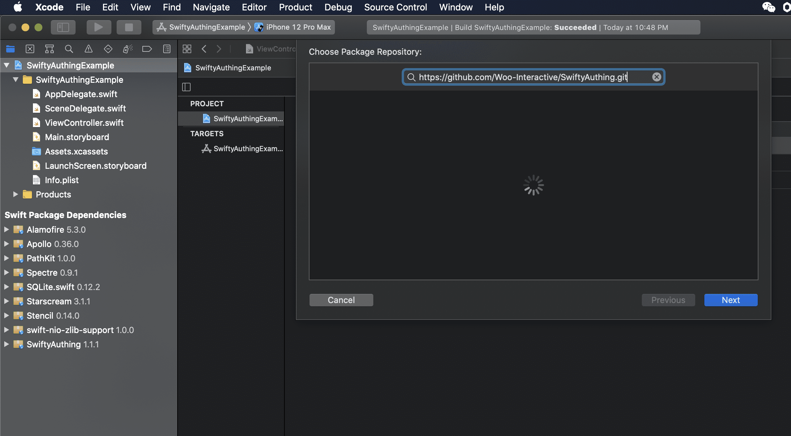
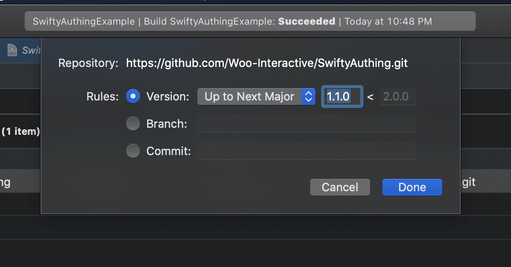

# SwiftyAuthing

**SwiftyAuthing** is a pure Swift library for [Authing](https://authing.cn).


## Requirements

- Swift 5.0 +
- Xcode 11 +
- iOS 10+


## Installation

### Swift Package Manager

1. Xcode - Project - Swift Packages
2. Add + https://github.com/Woo-Interactive/SwiftyAuthing.git
3. Select the latest version






4. Update to latest version (optional)


## Example

1. Clone repository

2. Change **UserPoolId and Host** in SwiftyAuthingExample - ViewController.swift

3. Run **SwiftyAuthingExample** with iOS simulator or device.

4. Test and check data with web console [https://console.authing.cn](https://console.authing.cn)


## How to use

```swift
import SwiftyAuthing

/// Config Information, change your UserPoolId
/// Find in https://console.authing.cn Setting - Basic Information & Application.
let userPoolId = "userPoolId"
let appId = "appId"

var client: AuthenticationClient?
var userid = ""

//使用 userPoolId 初始化
//self.client = AuthenticationClient(userPoolId: userPoolId)

//使用 userPoolId 和 appId 同时初始化
self.client = AuthenticationClient(userPoolId: userPoolId, appId: appId)

// 如在此类中调用用户 User 相关方法，需要在此设置此用户保存的有效的用户 AccessToken。
// 如需变动用户 AccessToken，只需再次赋值即可。
//self.client?.accessToken = "accessToken"


/// Register by Email and Password.
/// 使用邮箱注册
///
func registerByEmail() {
    //Normal
//        self.client?.registerByEmail(email: textEmail.text!, password: textPassword.text!, completion: {status in
//            if(status.errors == nil) {
//                //Success
//                print(status.data?.registerByEmail ?? "")
//                self.userid = status.data?.registerByEmail?.id ?? ""
//            } else {
//                //Failure
//                print(status.errors ?? "")
//            }
//        })
    
    //With result
    self.client?.registerByEmailWithResult(email: textEmail.text!, password: textPassword.text!, completion: {result in
        switch result {
        case .success(let graphQLResult):
            print(graphQLResult.data?.registerByEmail ?? "")
        case .failure(let error):
            print(error)
        }
    })
}

/// Register by Username and Password.
/// 使用用户名注册
///
func registerByUsername() {
    //Normal
//        self.client?.registerByUsername(username: textUsername.text!, password: textPassword.text!, completion:{status in
//            if(status.errors == nil) {
//                //Success
//                print(status.data?.registerByUsername ?? "")
//                self.userid = status.data?.registerByUsername?.id ?? ""
//            } else {
//                //Failure
//                print(status.errors ?? "")
//            }
//        })
    
    //With result
    self.client?.registerByUsernameWithResult(username: textUsername.text!, password: textPassword.text!, completion:{result in
        switch result {
        case .success(let graphQLResult):
            print(graphQLResult)
        case .failure(let error):
            print(error)
        }
    })
}

/// Register by Phone Number and SMS Code.
/// 使用手机号注册
///
func registerByPhoneCode() {
    
    //Normal
//        self.client?.registerByPhoneCode(phone: textPhone.text!, code: textPhonecode.text!, completion:{ status in
//            if(status.errors == nil) {
//                //Success
//                print(status.data?.registerByPhoneCode ?? "")
//                self.userid = status.data?.registerByPhoneCode?.id ?? ""
//            } else {
//                //Failure
//                print(status.errors ?? "")
//            }
//        })
    
    //With result
    self.client?.registerByPhoneCodeWithResult(phone: textPhone.text!, code: textPhonecode.text!, completion:{ result in
        switch result {
        case .success(let graphQLResult):
            let status = graphQLResult
            if(status.errors == nil) {
                //Success
                print(status.data?.registerByPhoneCode ?? "")
                self.userid = status.data?.registerByPhoneCode?.id ?? ""
            } else {
                //Failure
                print(status.errors ?? "")
            }
            print(graphQLResult)
            
        case .failure(let error):
            print(error)
        }
    })
    
}

/// Check Password Strength.
/// 检查密码强度
///
func checkPasswordStrength() {
    //Normal
//        self.client?.checkPasswordStrength(password: textPassword.text!, completion:{ status in
//            if(status.errors == nil) {
//                //Success
//                print(status.data?.checkPasswordStrength ?? "")
//            } else {
//                //Failure
//                print(status.errors ?? "")
//            }
//        })
    
    //With result
    self.client?.checkPasswordStrengthWithResult(password: textPassword.text!, completion:{ result in
        switch result {
        case .success(let graphQLResult):
            let status = graphQLResult
            if(status.errors == nil) {
                //Success
                print(status.data?.checkPasswordStrength ?? "")
            } else {
                //Failure
                print(status.errors ?? "")
            }
            print(graphQLResult)
        case .failure(let error):
            print(error)
        }

    })
}

/// Send SMS Code to Phone Number.
/// 发送短信验证码
///
func sendSmsCode() {
    //Normal
//        self.client?.sendSmsCode(phone: textPhone.text!, completion: { status in
//            print(status)
//        })
    
    //With result
    self.client?.sendSmsCodeWithResult(phone: textPhone.text!, completion: { result in
        print(result)
    })
}


/// Login by Email and Password.
/// 使用邮箱登录
///
func loginByEmail() {
    //Normal
//        self.client?.loginByEmail(email: textEmail.text!, password: textPassword.text!, completion:{ status in
//            if(status.errors == nil) {
//                //Success
//                print(status.data?.loginByEmail ?? "")
//            } else {
//                //Failure
//                print(status.errors ?? "")
//            }
//        })
    
    //With result
    self.client?.loginByEmailWithResult(email: textEmail.text!, password: textPassword.text!, completion:{ result in
        switch result {
        case .success(let graphQLResult):
            let status = graphQLResult
            if(status.errors == nil) {
                //Success
                print(status.data?.loginByEmail ?? "")
            } else {
                //Failure
                print(status.errors ?? "")
            }
            print(graphQLResult)
        case .failure(let error):
            print(error)
        }
    })
}


/// Login with Username and Password.
/// 使用用户名登录
func loginByUsername() {
    //Normal
//        self.client?.loginByUsername(username: textUsername.text!, password: textPassword.text!, completion:{ status in
//            if(status.errors == nil) {
//                //Success
//                print(status.data?.loginByUsername ?? "")
//            } else {
//                //Failure
//                print(status.errors ?? "")
//            }
//        })
    
    //With result
    self.client?.loginByUsernameWithResult(username: textUsername.text!, password: textPassword.text!, completion:{ result in
        switch result {
        case .success(let graphQLResult):
            let status = graphQLResult
            if(status.errors == nil) {
                //Success
                print(status.data?.loginByUsername ?? "")
            } else {
                //Failure
                print(status.errors ?? "")
            }
            print(graphQLResult)
        case .failure(let error):
            print(error)
        }
    })
}

/// Login by Phone Number and SMS Code.
/// 使用手机号验证码登录
///
func loginByPhoneCode() {
    //Normal
//        self.client?.loginByPhoneCode(phone: textPhone.text!, code: textPhonecode.text!, completion:{ status in
//            if(status.errors == nil) {
//                //Success
//                print(status.data?.loginByPhoneCode ?? "")
//            } else {
//                //Failure
//                print(status.errors ?? "")
//            }
//        })
    
    //With result
    self.client?.loginByPhoneCodeWithResult(phone: textPhone.text!, code: textPhonecode.text!, completion:{ result in
        switch result {
        case .success(let graphQLResult):
            let status = graphQLResult
            if(status.errors == nil) {
                //Success
                print(status.data?.loginByPhoneCode ?? "")
            } else {
                //Failure
                print(status.errors ?? "")
            }
            print(graphQLResult)
        case .failure(let error):
            print(error)
        }
    })
}


/// Login by Phone Number and Password.
/// 使用手机号密码登录
///
func loginByPhonePassword() {
    //Normal
//        self.client?.loginByPhonePassword(phone: textPhone.text!, password: textPassword.text!, completion:{ status in
//            if(status.errors == nil) {
//                //Success
//                print(status.data?.loginByPhonePassword ?? "")
//            } else {
//                //Failure
//                print(status.errors ?? "")
//            }
//        })
    
    //With result
    self.client?.loginByPhonePasswordWithResult(phone: textPhone.text!, password: textPassword.text!, completion:{ result in
        switch result {
        case .success(let graphQLResult):
            let status = graphQLResult
            if(status.errors == nil) {
                //Success
                print(status.data?.loginByPhonePassword ?? "")
            } else {
                //Failure
                print(status.errors ?? "")
            }
            print(graphQLResult)
        case .failure(let error):
            print(error)
        }
    })
}


/// Check Login Status.
/// 检测 Token 登录状态
///
func checkLoginStatus() {
    // Change your accessToken here
    let accessToken = self.client?.accessToken ?? ""
    print("accessToken: " + accessToken)
    
    //Normal
//        self.client?.checkLoginStatus(token: accessToken, completion:{ status in
//            if(status.errors == nil) {
//                //Success
//                print(status.data?.checkLoginStatus ?? "")
//            } else {
//                //Failure
//                print(status.errors ?? "")
//            }
//        })
    
    //With result
    self.client?.checkLoginStatusWithResult(token: accessToken, completion:{ result in
        switch result {
        case .success(let graphQLResult):
            let status = graphQLResult
            if(status.errors == nil) {
                //Success
                print(status.data?.checkLoginStatus ?? "")
            } else {
                //Failure
                print(status.errors ?? "")
            }
            print(graphQLResult)
        case .failure(let error):
            print(error)
        }
    })
}


/// Send Email.
/// 发送邮件
///
func sendEmail() {
    //Normal
//        self.client?.sendEmail(email: textEmail.text!, scene: EmailScene.resetPassword, completion: {status in
//            if(status.errors == nil) {
//                //Success
//                print(status.data?.sendEmail ?? "")
//            } else {
//                //Failure
//                print(status.errors ?? "")
//            }
//        })
    
    //With result
    self.client?.sendEmailWithResult(email: textEmail.text!, scene: EmailScene.resetPassword, completion: {result in
        switch result {
        case .success(let graphQLResult):
            let status = graphQLResult
            if(status.errors == nil) {
                //Success
                print(status.data?.sendEmail ?? "")
            } else {
                //Failure
                print(status.errors ?? "")
            }
            print(graphQLResult)
        case .failure(let error):
            print(error)
        }
    })
}

/// Reset Password by Phone Code.
/// 通过短信验证码重置密码
///
func resetPasswordByPhoneCode() {
    //Normal
//        self.client?.resetPasswordByPhoneCode(phone: textPhone.text!, code: textPhonecode.text!, newPassword: textPassword.text!, completion: {status in
//            if(status.errors == nil) {
//                //Success
//                print(status.data?.resetPassword ?? "")
//            } else {
//                //Failure
//                print(status.errors ?? "")
//            }
//        })
    
    //With result
    self.client?.resetPasswordByPhoneCodeWithResult(phone: textPhone.text!, code: textPhonecode.text!, newPassword: textPassword.text!, completion: {result in
        switch result {
        case .success(let graphQLResult):
            let status = graphQLResult
            if(status.errors == nil) {
                //Success
                print(status.data?.resetPassword ?? "")
            } else {
                //Failure
                print(status.errors ?? "")
            }
            print(graphQLResult)
        case .failure(let error):
            print(error)
        }
    })
}

/// Reset Password by Email Code.
/// 通过邮件验证码重置密码
///
func resetPasswordByEmailCode() {
    //Normal
//        self.client?.resetPasswordByEmailCode(email: textEmail.text!, code: textPhonecode.text!, newPassword: textPassword.text!, completion: {status in
//            if(status.errors == nil) {
//                //Success
//                print(status.data?.resetPassword ?? "")
//            } else {
//                //Failure
//                print(status.errors ?? "")
//            }
//        })
    
    //With result
    self.client?.resetPasswordByEmailCodeWithResult(email: textEmail.text!, code: textPhonecode.text!, newPassword: textPassword.text!, completion: {result in
        switch result {
        case .success(let graphQLResult):
            let status = graphQLResult
            if(status.errors == nil) {
                //Success
                print(status.data?.resetPassword ?? "")
            } else {
                //Failure
                print(status.errors ?? "")
            }
            print(graphQLResult)
        case .failure(let error):
            print(error)
        }
    })
}


/// Update Profile.
/// 修改用户资料
///
func updateProfile() {
    //Normal
//        self.client?.updateProfile(nickname: textUsername.text!, completion: {status in
//            if(status.errors == nil) {
//                //Success
//                print(status.data?.updateUser ?? "")
//            } else {
//                //Failure
//                print(status.errors ?? "")
//            }
//        })
    
    //With result
    self.client?.updateProfileWithResult(nickname: textUsername.text!, completion: {result in
        switch result {
        case .success(let graphQLResult):
            let status = graphQLResult
            if(status.errors == nil) {
                //Success
                print(status.data?.updateUser ?? "")
            } else {
                //Failure
                print(status.errors ?? "")
            }
            print(graphQLResult)
        case .failure(let error):
            print(error)
        }
    })
}


/// Update Password.
/// 更新用户密码
///
func updatePassword() {
    //Normal
//        self.client?.updatePassword(newPassword: textPassword.text!,oldPassword: textPassword.text!, completion: {status in
//            if(status.errors == nil) {
//                //Success
//                print(status.data?.updatePassword ?? "")
//            } else {
//                //Failure
//                print(status.errors ?? "")
//            }
//        })
    
    //With result
    self.client?.updatePasswordWithResult(newPassword: textPassword.text!,oldPassword: textPassword.text!, completion: {result in
        switch result {
        case .success(let graphQLResult):
            let status = graphQLResult
            if(status.errors == nil) {
                //Success
                print(status.data?.updatePassword ?? "")
            } else {
                //Failure
                print(status.errors ?? "")
            }
            print(graphQLResult)
        case .failure(let error):
            print(error)
        }
    })
}


/// Update Phone.
/// 更新用户手机号
///
func updatePhone() {
    //Normal
//        self.client?.updatePhone(phone: textPhone.text!, phoneCode: textPhonecode.text!, oldPhone: textPhone.text!, oldPhoneCode: textPhonecode.text!, completion: {status in
//            if(status.errors == nil) {
//                //Success
//                print(status.data?.updatePhone ?? "")
//            } else {
//                //Failure
//                print(status.errors ?? "")
//            }
//        })
    
    //With result
    self.client?.updatePhoneWithResult(phone: textPhone.text!, phoneCode: textPhonecode.text!, oldPhone: textPhone.text!, oldPhoneCode: textPhonecode.text!, completion: {result in
        switch result {
        case .success(let graphQLResult):
            let status = graphQLResult
            if(status.errors == nil) {
                //Success
                print(status.data?.updatePhone ?? "")
            } else {
                //Failure
                print(status.errors ?? "")
            }
            print(graphQLResult)
        case .failure(let error):
            print(error)
        }
    })
}


/// Update Email.
/// 更新用户邮箱
///
func updateEmail() {
    //Normal
//        self.client?.updateEmail(email: textEmail.text!, emailCode: textPhonecode.text!, oldEmail: textEmail.text!, oldEmailCode: textPhonecode.text!, completion: {status in
//            if(status.errors == nil) {
//                //Success
//                print(status.data?.updateEmail ?? "")
//            } else {
//                //Failure
//                print(status.errors ?? "")
//            }
//        })
    
    //With result
    self.client?.updateEmailWithResult(email: textEmail.text!, emailCode: textPhonecode.text!, oldEmail: textEmail.text!, oldEmailCode: textPhonecode.text!, completion: {result in
        switch result {
        case .success(let graphQLResult):
            let status = graphQLResult
            if(status.errors == nil) {
                //Success
                print(status.data?.updateEmail ?? "")
            } else {
                //Failure
                print(status.errors ?? "")
            }
            print(graphQLResult)
        case .failure(let error):
            print(error)
        }
    })
}


///Refresh Token.
/// 刷新当前用户的 token
///
func refreshToken() {
    //Normal
//        self.client?.refreshToken(completion:{ status in
//            if(status.errors == nil) {
//                //Success
//                print(status.data?.refreshToken ?? "")
//            } else {
//                //Failure
//                print(status.errors ?? "")
//            }
//        })
    
    //With result
    self.client?.refreshTokenWithResult(completion:{ result in
        switch result {
        case .success(let graphQLResult):
            let status = graphQLResult
            if(status.errors == nil) {
                //Success
                print(status.data?.refreshToken ?? "")
            } else {
                //Failure
                print(status.errors ?? "")
            }
            print(graphQLResult)
        case .failure(let error):
            print(error)
        }
    })
}


/// Get Current User.
/// 获取当前登录的用户信息
///
func getCurrentUser() {
    //Normal
//        self.client?.getCurrentUser(completion: {status in
//            if(status.errors == nil) {
//                //Success
//                print(status.data?.user ?? "")
//            } else {
//                //Failure
//                print(status.errors ?? "")
//            }
//        })
    
    //With result
    self.client?.getCurrentUserWithResult(completion: {result in
        switch result {
        case .success(let graphQLResult):
            let status = graphQLResult
            if(status.errors == nil) {
                //Success
                print(status.data?.user ?? "")
            } else {
                //Failure
                print(status.errors ?? "")
            }
            print(graphQLResult)
        case .failure(let error):
            print(error)
        }
    })
}


/// Logout Current User.
/// 退出登录
///
func logout() {
    //Normal
//        self.client?.logout(completion:{ status in
//            if(status.errors == nil) {
//                //Success
//                print(status.data?.updateUser ?? "")
//            } else {
//                //Failure
//                print(status.errors ?? "")
//            }
//        })
    
    //With result
    self.client?.logoutWithResult(completion:{ result in
        switch result {
        case .success(let graphQLResult):
            let status = graphQLResult
            if(status.errors == nil) {
                //Success
                print(status.data?.updateUser ?? "")
            } else {
                //Failure
                print(status.errors ?? "")
            }
            print(graphQLResult)
        case .failure(let error):
            print(error)
        }
    })
}

/// bindPhone.
/// 绑定手机号
///
func bindPhone() {
    //Normal
//        self.client?.bindPhone(phone: textPhone.text!, phoneCode: textPhonecode.text!, completion:{ status in
//            if(status.errors == nil) {
//                //Success
//                print(status.data?.bindPhone ?? "")
//            } else {
//                //Failure
//                print(status.errors ?? "")
//            }
//        })
    
    //With result
    self.client?.bindPhoneWithResult(phone: textPhone.text!, phoneCode: textPhonecode.text!, completion:{ result in
        switch result {
        case .success(let graphQLResult):
            let status = graphQLResult
            if(status.errors == nil) {
                //Success
                print(status.data?.bindPhone ?? "")
            } else {
                //Failure
                print(status.errors ?? "")
            }
            print(graphQLResult)
        case .failure(let error):
            print(error)
        }
    })
}


/// unbindEmail.
/// 解绑邮箱
///
func unbindEmail() {
    //Normal
//        self.client?.unbindEmail(completion:{ status in
//            if(status.errors == nil) {
//                //Success
//                print(status.data?.unbindEmail ?? "")
//            } else {
//                //Failure
//                print(status.errors ?? "")
//            }
//        })
    
    //With result
    self.client?.unbindEmailWithResult(completion:{ result in
        switch result {
        case .success(let graphQLResult):
            let status = graphQLResult
            if(status.errors == nil) {
                //Success
                print(status.data?.unbindEmail ?? "")
            } else {
                //Failure
                print(status.errors ?? "")
            }
            print(graphQLResult)
        case .failure(let error):
            print(error)
        }
    })
}


/// bindPhone.
/// 绑定手机号
///
func unbindPhone() {
    //Normal
//        self.client?.unbindPhone(completion:{ status in
//            if(status.errors == nil) {
//                //Success
//                print(status.data?.unbindPhone ?? "")
//            } else {
//                //Failure
//                print(status.errors ?? "")
//            }
//        })
    
    //With result
    self.client?.unbindPhoneWithResult(completion:{ result in
        switch result {
        case .success(let graphQLResult):
            let status = graphQLResult
            if(status.errors == nil) {
                //Success
                print(status.data?.unbindPhone ?? "")
            } else {
                //Failure
                print(status.errors ?? "")
            }
            print(graphQLResult)
        case .failure(let error):
            print(error)
        }
    })
}

/// List Udv.
/// 获取当前用户的自定义数据列表
///
func listUdv() {
    //Normal
//        self.client?.listUdv(completion:{ status in
//            if(status.errors == nil) {
//                //Success
//                print(status.data?.udv ?? "")
//            } else {
//                //Failure
//                print(status.errors ?? "")
//            }
//        })
    
    //With result
    self.client?.listUdvWithResult(completion:{ result in
        switch result {
        case .success(let graphQLResult):
            let status = graphQLResult
            if(status.errors == nil) {
                //Success
                print(status.data?.udv ?? "")
            } else {
                //Failure
                print(status.errors ?? "")
            }
            print(graphQLResult)
        case .failure(let error):
            print(error)
        }
    })
}


/// Set Udv.
/// 添加自定义数据
///
func setUdv() {
    //Normal
//        self.client?.setUdv(key: "HelloDate", value: Date(), completion:{ status in
//            if(status.errors == nil) {
//                //Success
//                print(status.data?.setUdv ?? "")
//            } else {
//                //Failure
//                print(status.errors ?? "")
//            }
//        })
    
    //With result
    self.client?.setUdvWithResult(key: "HelloDate", value: Date(), completion:{ result in
        switch result {
        case .success(let graphQLResult):
            let status = graphQLResult
            if(status.errors == nil) {
                //Success
                print(status.data?.setUdv ?? "")
            } else {
                //Failure
                print(status.errors ?? "")
            }
            print(graphQLResult)
        case .failure(let error):
            print(error)
        }
    })
}

/// Remove Udv.
/// 删除自定义数据
///
func removeUdv() {
    //Normal
//        self.client?.removeUdv(key: "HelloDate", completion:{ status in
//            if(status.errors == nil) {
//                //Success
//                print(status.data?.removeUdv ?? "")
//            } else {
//                //Failure
//                print(status.errors ?? "")
//            }
//        })
    
    //With result
    self.client?.removeUdvWithResult(key: "HelloDate", completion:{ result in
        switch result {
        case .success(let graphQLResult):
            let status = graphQLResult
            if(status.errors == nil) {
                //Success
                print(status.data?.removeUdv ?? "")
            } else {
                //Failure
                print(status.errors ?? "")
            }
            print(graphQLResult)
        case .failure(let error):
            print(error)
        }
    })
}


/// listOrg.
/// 获取用户所在组织机构
func listOrg() {
    //Normal
//        self.client?.listOrg(completion: { status in
//            print(status)
//        })
    
    //With result
    self.client?.listOrgWithResult(completion: { result in
        print(result)
    })
}

/// loginByLdap.
/// 使用 LDAP 用户名登录
func loginByLdap() {
    //Normal
//        self.client?.loginByLdap(username: textUsername.text!, password: textPassword.text!, completion: { status in
//            print(status)
//        })
    
    //With result
    self.client?.loginByLdapWithResult(username: textUsername.text!, password: textPassword.text!, completion: { result in
        print(result)
    })
}


/// Login by WeChat Code.
/// 通过微信认证码登陆
///
func loginByWeChatCode() {
    //通过微信SDK返回的认证码登陆 https://docs.authing.cn/social-login/mobile/wechat.html
    let code = "code"
    //Normal
//        self.client?.loginByWeChatCode(code: code, completion: { status in
//            print(status)
//        })
    
    //With result
    self.client?.loginByWeChatCodeWithResult(code: code, completion: { result in
        print(result)
    })
}


/// User Id Verify.
/// 实名认证 - 使用姓名，身份证号码，人脸图像，需要登录后调用
///
func userIdVerify() {
    //*需要登录后调用
    
    //via faceImageURL
    self.client?.userIdVerify(name: "张三", idCard: "123456", faceImageURL: URL(string: "http://xxx.jpg")!, completion: { result in
        print(result)
    })
    
    //via faceImageBase64, 如使用 UIImage 可以使用 getBase64FromImage 转换
//        self.client?.userIdVerify(name: "张三", idCard: "123456", faceImageBase64: "data:image/jpeg;base64,/9j/4QFmRXhpZgA", completion: { result in
//            print(result)
//        })
    
//        success msg
//        {
//            "code": 200,
//            "message": "实名认证成功"
//        }
}

/// Get Base64 from UIImage
/// UIImage 转 Base64
///
func getBase64FromImage(_ name: String) -> String{
    let imageOrigin = UIImage(named: name)
    if let image = imageOrigin {
        let dataTmp = image.pngData()
        if let data = dataTmp {
            let imageStrTT = data.base64EncodedString()
            return imageStrTT
        }
    }
    return ""
}

/// User Id Verify Status.
/// 查询实名认证状态，需要登录后调用
///
func userIdVerifyStatus() {
    //*需要登录后调用
    self.client?.userIdVerifyStatus(completion: { result in
        print(result)
    })
    
//        success msg
//        {
//            "code": 200,
//            "data": true,
//            "message": "查询实名认证状态成功"
//        }
}

```

